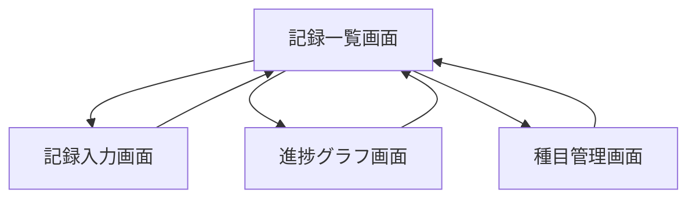

# 02. 画面設計（筋トレ管理アプリ）

このドキュメントは、[01_要件定義.md](01_%E8%A6%81%E4%BB%B6%E5%AE%9A%E7%BE%A9.md) で整理した要件を、実際の画面単位に分解するための設計書です。

ブログで流れを追いやすくするため、要件定義ファイルはそのまま残し、このファイルを次フェーズの独立した成果物として作成します。

## 0. このフェーズの目的
- 要件を画面に落とし込む
- 各画面の役割を明確にする
- 実装前に必要な入力項目、表示項目、遷移を整理する

## 1. 画面設計とは何か
画面設計は、見た目を先に決める作業ではありません。
先に決めるべきなのは、次の3つです。

1. この画面は何のために存在するのか
2. ユーザーはこの画面で何をするのか
3. そのために何を入力し、何を表示するのか

学習ポイント:
- 画面設計は「UIのお絵描き」ではなく「要件を操作に変換する作業」です
- ここで役割分担が曖昧だと、後の実装で画面が肥大化しやすくなります

## 2. 今回の主要画面
要件定義から考えると、MVPでは次の4画面が必要です。

- S-01: 記録一覧画面
- S-02: 記録入力画面
- S-03: 進捗グラフ画面
- S-04: 種目管理画面

この4画面にした理由:
- 記録一覧画面: 過去記録の確認と検索の起点になる
- 記録入力画面: 入力のしやすさという最重要課題を担当する
- 進捗グラフ画面: 成長実感を可視化する
- 種目管理画面: 入力補助に必要な種目データを管理する

## 3. 画面遷移の考え方
最初の版では、遷移はできるだけ単純にします。

学習ポイント:
- 最初は一覧画面を起点にすると、アプリ全体の流れを把握しやすいです
- 入力後に一覧へ戻す流れにすると、保存結果をすぐ確認できます
- 複雑な階層遷移は後からでも追加できます。最初は単純な方が実装しやすいです

## 4. 各画面の詳細

### 4-1. S-01 記録一覧画面

#### 画面の目的
- 過去の記録を振り返る
- 日付や種目で検索する
- 他の主要画面への起点になる

#### 主な操作
- 日付で絞り込む
- 種目で絞り込む
- 記録を選んで詳細を見る
- 新しい記録を追加する

#### 入力項目
- filterDate
- filterExercise

#### 表示項目
- 記録日
- 種目名
- セットの概要
- メモの有無
- 検索条件

#### エラー時表示
- 条件に一致する記録がありません
- 記録の取得に失敗しました

#### UIメモ
- スマホでは縦に並ぶカード形式が向いている
- PCでは将来的に表形式にもできる
- まずは「読みやすいこと」を優先する

#### 関連要件
- F-04
- US-04

### 4-2. S-02 記録入力画面

#### 画面の目的
- トレーニング直後に、素早く記録を保存する

#### 主な操作
- 日付を選ぶ
- 種目を選ぶまたは検索する
- 重量と回数を入力する
- セットを追加する
- メモを入力する
- 保存する

#### 入力項目
- date
- exerciseId または exerciseName
- weight
- reps
- setOrder
- note

#### 表示項目
- 登録済み種目の候補
- 前回の同種目記録
- 現在入力中のセット一覧

#### エラー時表示
- 種目を選択してください
- 重量を入力してください
- 回数を入力してください
- 数字で入力してください

#### UIメモ
- 最重要課題が入力の手間なので、入力画面は最もシンプルにする
- 前回記録を近くに置くと、比較しながら入力しやすい
- 種目候補は上部に置くと操作しやすい

#### 関連要件
- F-02
- F-03
- F-05
- US-01
- US-02

### 4-3. S-03 進捗グラフ画面

#### 画面の目的
- 成長を見える化する
- 継続のモチベーションにつなげる

#### 主な操作
- 種目を選ぶ
- 表示期間を切り替える
- グラフを確認する

#### 入力項目
- exerciseId
- period

#### 表示項目
- 重量推移グラフ
- 日付ごとの記録値
- 直近記録
- 前回比

#### エラー時表示
- この種目の記録がまだありません
- グラフデータの取得に失敗しました

#### UIメモ
- MVPでは重量推移を最優先にする
- グラフだけでなく数値も併記すると理解しやすい
- 種目選択は必須なので、上部に固定すると使いやすい

#### 関連要件
- F-06
- US-03

### 4-4. S-04 種目管理画面

#### 画面の目的
- 入力補助に使う種目データを管理する

#### 主な操作
- 種目を追加する
- 種目を編集する
- 種目を削除する
- 部位で確認する

#### 入力項目
- name
- bodyPart

#### 表示項目
- 種目名
- 部位
- 編集ボタン
- 削除ボタン

#### エラー時表示
- 種目名を入力してください
- 同じ種目名がすでに存在します
- 使用中の種目は削除できません

#### UIメモ
- この画面は毎回使うわけではないので、一覧画面から入れれば十分
- 将来、説明や画像を持たせるならこの画面を拡張する

#### 関連要件
- F-01
- US-02

## 5. 画面ごとの役割分担まとめ

| 画面 | 一番大きな役割 | 主に解決する課題 |
| --- | --- | --- |
| 記録一覧画面 | 過去記録の確認と検索 | 前回との差が見づらい |
| 記録入力画面 | すばやい記録入力 | 入力が面倒 |
| 進捗グラフ画面 | 成長の見える化 | 成長実感が得にくい |
| 種目管理画面 | 種目データ管理 | 毎回の手入力が面倒 |

学習ポイント:
- 画面ごとに「一番大きな役割」を1つ決めておくと設計がぶれにくいです
- 1画面に役割を詰め込みすぎると、UIもコードも複雑になります

## 6. データ項目と画面の対応

| データ項目 | 記録一覧 | 記録入力 | 進捗グラフ | 種目管理 |
| --- | --- | --- | --- | --- |
| Exercise.id | ○ | ○ | ○ | ○ |
| Exercise.name | ○ | ○ | ○ | ○ |
| Exercise.bodyPart |  |  |  | ○ |
| WorkoutSession.date | ○ | ○ | ○ |  |
| WorkoutSession.note | ○ | ○ |  |  |
| WorkoutSet.weight | ○ | ○ | ○ |  |
| WorkoutSet.reps | ○ | ○ | ○ |  |
| WorkoutSet.setOrder | ○ | ○ |  |  |

学習ポイント:
- この表があると、次のデータ設計で「どの項目が必要か」を判断しやすくなります
- 実装時には、この表が API 設計や状態管理の分割にもつながります

## 7. この段階で決めなくてよいこと
次のようなことは、まだ厳密に決めなくて大丈夫です。

- 色やフォント
- ボタンの細かい見た目
- アニメーション
- コンポーネント名

理由:
- 今は「何をさせるか」の整理が優先だから
- 見た目を先に決めると、本来の課題解決より装飾に意識が寄りやすいから

## 8. 次に進むためのチェック
この画面設計ができると、次のデータ設計に進めます。

- [x] 主要画面が定義されている
- [x] 各画面の目的がある
- [x] 各画面の入力項目がある
- [x] 各画面の表示項目がある
- [x] エラー時表示を考えられている
- [x] 大まかな画面遷移がある

## 9. 次フェーズでやること
次はデータ設計に進みます。

次に考える内容:
1. Exercise、WorkoutSession、WorkoutSet の関係
2. 必須項目と任意項目の区別
3. 削除ルールや参照ルール
4. 将来の比較機能に備えて、どこまで拡張しやすくするか

## 10. まとめ
- 要件定義は「何を作るか」を決める工程
- 画面設計は「その要件をどの画面で実現するか」を決める工程
- 今回の画面設計では、4つの主要画面に役割を分担した
- この状態なら、次のデータ設計へ自然に進める
