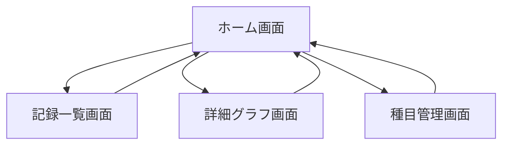

# 02. 画面設計 ver2（筋トレ管理アプリ）

このドキュメントは、[01_要件定義.md](01_%E8%A6%81%E4%BB%B6%E5%AE%9A%E7%BE%A9.md) をもとにした画面設計の第2版です。

第1版では「一覧画面を起点」にしていましたが、この第2版では、あなたの意図に合わせて「入力して、その場で成長を確認できること」を中心に再設計しています。

ブログ向けに流れを追いやすくするため、既存ファイルは残し、このファイルを別バージョンとして新規作成しています。

## 0. この版で変えたこと
第1版からの主な変更点は次のとおりです。

- メイン画面を記録一覧からホーム画面へ変更
- ホーム画面に「記録入力」と「直近の成長グラフ」を同居させる構成に変更
- グラフはユーザーが表示対象を切り替えられる前提を追加
- 一覧画面は主画面ではなく、過去記録を深く確認する補助画面へ役割変更

学習ポイント:
- 画面遷移は後から変更できます
- ただし、メイン画面の思想はデータ取得やコンポーネント構成に影響するため、実装前に方向を決める方が楽です
- 今回の変更は「課題に対して本当に中心に置くべき体験は何か」を見直した結果です

## 1. この構成は実装後でも変更できるか
結論: 変更できます。

ただし、次の違いがあります。

1. 実装前に変える場合
- 画面の責務を最初から正しく分けられる
- APIや状態管理の設計を最適化しやすい
- 手戻りが少ない

2. 実装後に変える場合
- ルーティング変更だけで済むこともある
- ただし、ホーム画面で必要なデータ取得が増えると、画面構成の見直しが必要になる
- 既存コンポーネントの責務がずれていると修正コストが上がる

今回のケースでは、今の段階で変えるのが正解です。
理由は、あなたが作りたい価値の中心が「記録すること」と「成長を確認すること」だからです。

## 2. ver2 の設計方針
このアプリの中心体験を次のように定義します。

- すぐ入力できる
- 入力直後に成長を確認できる
- 見たい成長指標を自分で切り替えられる
- ユーザーごとのメニュー構成に沿って迷わず入力できる

つまり、アプリを開いたときに最初に見えるべきものは次の2つです。

- すぐ記録できる入力エリア
- 直近の成長を確認できるグラフエリア

ここでいう「すぐ記録できる」とは、自由入力を減らし、次の流れで入力できることを意味します。

1. トレーニング記録を開始する
2. 自分が登録したメニューグループを選ぶ
3. その中の種目を選ぶ
4. その種目のセット数を決める
5. セット数ぶんの入力欄に重量や回数を入力する

## 3. 主要画面
ver2 では、次の4画面構成にします。

- S-01: ホーム画面（入力 + 成長確認）
- S-02: 記録一覧画面
- S-03: 詳細グラフ画面
- S-04: 種目管理画面

この4画面にした理由:
- ホーム画面: 入力と成長確認をまとめて、最も使う体験を起点にする
- 記録一覧画面: 過去記録の検索と振り返りに集中させる
- 詳細グラフ画面: ホームでは見切れない分析を行う
- 種目管理画面: 入力補助の元データを管理する

## 4. 画面遷移
ver2 では、ホーム画面を起点にします。

学習ポイント:
- メイン画面は「最も頻繁に使う価値」が集まる場所にするのが基本です
- 今回は「入力」と「成長確認」が中核なので、一覧ではなくホームを起点にする方が自然です
- 一覧は重要ですが、毎回最初に開く必要はありません

## 5. 各画面の詳細

### 5-1. S-01 ホーム画面（入力 + 成長確認）

#### 画面の目的
- すぐにトレーニング記録を入力する
- 直近の成長状況をひと目で確認する
- アプリの中心体験を1画面で完結させる

#### 記録フローの前提
この画面の記録入力は、1つの大きなフォームを最初から全部表示する方式ではなく、段階入力にします。

流れ:
1. 利用者が「トレーニング記録を開始」ボタンを押す
2. 利用者が自分用に登録したメニューグループを選ぶ
3. 選んだメニューグループに含まれる筋トレ種目一覧を表示する
4. 利用者が対象種目を選ぶ
5. 利用者がその種目のセット数を入力する
6. 入力したセット数ぶんのフォームを自動表示する
7. 各セットの重量・回数を入力して保存する

メニューグループの例:
- 上半身メニュー / 下半身メニュー
- Aメニュー / Bメニュー / Cメニュー
- 胸 / 背中 / 肩 / 腕

学習ポイント:
- これは「入力フォーム設計」ではなく「入力体験設計」です
- ユーザーが普段考えている単位に合わせて入力順序を作ると、直感的なアプリになりやすいです

#### 主な操作
- トレーニング記録を開始する
- 日付を選ぶ
- メニューグループを選ぶ
- メニューグループ内の種目を選ぶ
- セット数を入力する
- 自動生成されたセット入力欄に重量と回数を入力する
- 種目ごとの記録を保存する
- 同じメニューグループ内の別種目へ進む
- 表示するグラフの対象を切り替える
- 詳細グラフ画面へ進む
- 記録一覧画面へ進む

#### 入力項目
- date
- selectedMenuGroupId
- selectedExerciseId
- setCount
- weights[]
- reps[]
- setOrders[]
- note
- selectedGraphMetric
- selectedGraphExercise
- selectedGraphPeriod

#### 表示項目
- トレーニング記録を開始するボタン
- 登録済みメニューグループ一覧
- 選択したメニューグループに属する種目一覧
- 選択中種目の前回記録
- 入力したセット数に応じたセット入力欄
- 現在入力中のセット一覧
- 直近の成長グラフ
- 前回比または直近の伸び率
- 現在表示中のグラフ条件

#### エラー時表示
- メニューグループを選択してください
- 種目を選択してください
- セット数を入力してください
- 重量を入力してください
- 回数を入力してください
- 数字で入力してください
- グラフ表示対象のデータがありません

#### UIメモ
- スマホでは上に入力、下にグラフの縦並びが自然
- PCでは左右2カラムにして、左に入力、右にグラフを置く構成が見やすい
- 入力エリアは「開始前」「メニュー選択後」「種目選択後」で表示内容を切り替える段階式UIが向いている
- セット数入力後にフォームを自動生成すると、毎回セット追加ボタンを押す手間を減らせる
- ホーム画面に情報を入れすぎると重くなるので、グラフは「直近の1つ」を基本にする
- 詳細分析は別画面に逃がすことで、ホームを使いやすく保つ

#### グラフ切り替え候補
ユーザーが切り替えられる候補として、まずは次のようなものが考えられます。

- 種目別の重量推移
- 種目別の回数推移
- 総負荷の推移
- 直近7日 / 30日 / 90日

学習ポイント:
- ここで大事なのは「全部見せる」ことではなく、「一番見たいものをすぐ見せる」ことです
- カスタマイズ可能にするなら、ホームでは1つだけ選べる設計の方がシンプルです

#### 関連要件
- F-02
- F-03
- F-05
- F-06
- US-01
- US-02
- US-03

### 5-2. S-02 記録一覧画面

#### 画面の目的
- 過去の記録をまとめて確認する
- 日付や種目で検索する

#### 主な操作
- 日付で絞り込む
- 種目で絞り込む
- 記録を選んで確認する
- ホーム画面へ戻る

#### 入力項目
- filterDate
- filterExercise

#### 表示項目
- 記録日
- 種目名
- セット概要
- メモの有無
- 検索条件

#### エラー時表示
- 条件に一致する記録がありません
- 記録の取得に失敗しました

#### UIメモ
- ver2 では一覧画面は主役ではなく補助画面
- その代わり、過去検索には強い画面として残す

#### 関連要件
- F-04
- US-04

### 5-3. S-03 詳細グラフ画面

#### 画面の目的
- ホーム画面より詳しく成長推移を分析する
- 複数の条件でグラフを見比べる

#### 主な操作
- 種目を選ぶ
- グラフ種別を切り替える
- 期間を切り替える
- ホーム画面へ戻る

#### 入力項目
- exerciseId
- graphMetric
- period

#### 表示項目
- 重量推移グラフ
- 回数推移グラフ
- 総負荷の推移
- 直近記録
- 前回比

#### エラー時表示
- この条件に一致する記録がありません
- グラフデータの取得に失敗しました

#### UIメモ
- ホーム画面では簡易表示、ここでは詳細表示と役割を分ける
- 比較対象が増えたときも、詳細グラフ画面なら拡張しやすい

#### 関連要件
- F-06
- US-03

### 5-4. S-04 種目管理画面

#### 画面の目的
- 入力補助に使うメニューグループと種目データを管理する

#### 主な操作
- メニューグループを追加する
- メニューグループ名を編集する
- メニューグループを削除する
- メニューグループに種目を追加する
- 種目を編集する
- 種目を削除する
- メニューグループごとの種目一覧を確認する

#### 入力項目
- menuGroupName
- exerciseName
- bodyPart
- exerciseOrder

#### 表示項目
- メニューグループ名
- メニューグループ配下の種目一覧
- 種目名
- 部位
- 並び順
- 編集ボタン
- 削除ボタン

#### エラー時表示
- メニューグループ名を入力してください
- 種目名を入力してください
- 同じ名前がすでに存在します
- 使用中のメニューグループまたは種目は削除できません

#### UIメモ
- 種目管理は頻度が低いので、常時前面に出さない
- ただし入力体験を支える重要画面なので削らない
- 「メニューグループ -> 種目」の階層が分かるUIにする必要がある
- 最初はツリー表示より、グループ見出しの下に種目一覧を並べる形の方が実装しやすい

#### 関連要件
- F-01
- US-02

#### 補足
この画面で管理する対象は、単なる種目マスタだけではありません。
この ver2 では、次のような階層を持つ前提で考えます。

- メニューグループ
    - 例: 上半身メニュー
    - 例: Aメニュー
    - 例: 胸
- 各メニューグループの中の筋トレ種目
    - 例: ベンチプレス
    - 例: ダンベルフライ
    - 例: ラットプルダウン

## 6. ver2 の役割分担まとめ

| 画面 | 一番大きな役割 | 主に解決する課題 |
| --- | --- | --- |
| ホーム画面 | 入力と成長確認の両立 | 入力が面倒 / 成長実感が得にくい / どの種目を入れるか迷いやすい |
| 記録一覧画面 | 過去記録の検索と確認 | 前回との差が見づらい |
| 詳細グラフ画面 | 成長の詳細分析 | 成長の把握を深めたい |
| 種目管理画面 | メニューグループと種目データ管理 | 毎回の手入力が面倒 |

## 7. ver2 のメリットと注意点

### メリット
- 入力と確認が1画面でつながる
- ユーザーがアプリを開いてすぐ価値を感じやすい
- あなたの作りたい体験に近い
- ユーザーごとのトレーニングメニューに沿って入力できる

### 注意点
- ホーム画面に責務が集まりやすい
- データ取得が少し増える
- 画面が重くならないよう、ホームのグラフは簡易表示に絞る必要がある
- メニューグループと種目の階層データを持つため、データ設計を少し丁寧に考える必要がある

学習ポイント:
- 良い設計は「何でも載せる設計」ではなく、「中心体験を強くする設計」です
- 今回の ver2 は、まさに中心体験を優先した設計です

## 8. この版で次に進めるか
この ver2 でも、次のデータ設計へ進めます。

- [x] 主要画面が定義されている
- [x] 画面起点が明確になっている
- [x] 入力とグラフの同居方針が決まっている
- [x] グラフのカスタマイズ方針がある
- [x] 詳細分析を別画面へ分ける判断がある

## 9. 次フェーズで考えること
次はデータ設計で、特に次を考える必要があります。

1. ホーム画面で同時に取得するデータは何か
2. グラフ設定をユーザーごとに保存するか
3. 成長率をどう定義するか
4. 総負荷を使うなら計算式をどうするか
5. メニューグループと種目の階層をどう保存するか

## 10. まとめ
- 画面遷移は後から変更できる
- ただし、今の段階で変える方がコストは低い
- あなたのアプリでは「入力」と「成長確認」が中心価値なので、ホーム画面を起点にするのは合理的
- メイン画面に入力と直近グラフを置く設計は十分可能
- その考えを反映した第2版として、このファイルを作成した
