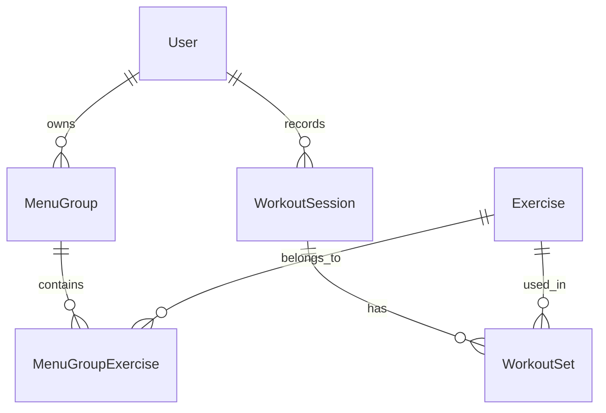

# 03. データ設計（筋トレ管理アプリ）

このドキュメントは、[01_要件定義.md](01_%E8%A6%81%E4%BB%B6%E5%AE%9A%E7%BE%A9.md) と [02_画面設計ver2.md](02_%E7%94%BB%E9%9D%A2%E8%A8%AD%E8%A8%88ver2.md) をもとに、アプリで扱うデータの構造を決めるための設計書です。

ブログ向けに開発の流れが追えるよう、既存ファイルは残したまま、このファイルを次フェーズの独立した成果物として新規作成します。

## 0. このフェーズの目的
- 画面で必要な情報を、どの単位で保存するか決める
- データ同士の関係を明確にする
- 実装前に、無理のない保存構造を決める

## 1. データ設計とは何か
データ設計は、単に項目名を並べる作業ではありません。
次の3つを決める作業です。

1. 何を1件のデータとして扱うか
2. どのデータとどのデータがつながるか
3. 削除・更新したときに何が影響を受けるか

学習ポイント:
- 画面設計が「ユーザーから見た操作の整理」だとすると、データ設計は「システムの中でどう保存するか」の整理です
- ここが曖昧だと、実装中に同じ情報を何度も重複して持ちやすくなります

## 2. 今回の中心になる考え方
画面設計 ver2 では、次の入力フローを採用しています。

1. トレーニング記録を開始する
2. ユーザーが作成したメニューグループを選ぶ
3. メニューグループ内の種目を選ぶ
4. セット数を決める
5. セット数ぶんの重量・回数を記録する

この流れを支えるには、最低でも次の5種類のデータが必要です。

- User: 誰のデータか
- MenuGroup: どんなグループ分けでメニューを整理しているか
- Exercise: どんな筋トレ種目があるか
- MenuGroupExercise: どのメニューグループにどの種目が属するか
- WorkoutSession / WorkoutSet: 実際の記録

## 3. 主要エンティティ一覧
今回の MVP では、次の6つを主要データとして扱います。

- User
- MenuGroup
- Exercise
- MenuGroupExercise
- WorkoutSession
- WorkoutSet

補足:
- 今回は学習優先なので、グラフ設定保存などの拡張データは後回しにします
- まずは「入力できる」「保存できる」「見返せる」を支える最小構成にします

## 4. データの関係

学習ポイント:
- User と MenuGroup は 1対多
- MenuGroup と Exercise は多対多に近い関係なので、中間データとして MenuGroupExercise を置きます
- WorkoutSession は「その日の記録のまとまり」、WorkoutSet は「1セットごとの明細」です

## 5. 各データの詳細

### 5-1. User

#### 役割
- そのデータが誰のものかを表す

#### 項目
| 項目名 | 型イメージ | 必須 | 説明 |
| --- | --- | --- | --- |
| id | string | ○ | ユーザーID |
| displayName | string | ○ | 表示名 |
| createdAt | datetime | ○ | 作成日時 |
| updatedAt | datetime | ○ | 更新日時 |

#### 学習ポイント
- 今は認証未定でも、将来社内利用を考えるなら User を最初から分けておく方が安全です
- 1人利用だけを前提にしても、あとで複数人対応にすると修正が大きくなりやすいです

### 5-2. MenuGroup

#### 役割
- ユーザーが自分で決めるメニューのまとまりを表す

#### 例
- 上半身メニュー
- 下半身メニュー
- Aメニュー
- Bメニュー
- 胸
- 背中

#### 項目
| 項目名 | 型イメージ | 必須 | 説明 |
| --- | --- | --- | --- |
| id | string | ○ | メニューグループID |
| userId | string | ○ | 所有ユーザー |
| name | string | ○ | グループ名 |
| description | string |  | 補足説明 |
| sortOrder | number | ○ | 表示順 |
| createdAt | datetime | ○ | 作成日時 |
| updatedAt | datetime | ○ | 更新日時 |

#### 学習ポイント
- MenuGroup は「種目そのもの」ではなく「種目をまとめる箱」です
- 並び順を持たせると、Aメニュー -> Bメニューのような表示順を固定できます

### 5-3. Exercise

#### 役割
- 筋トレ種目そのものを表す

#### 例
- ベンチプレス
- ダンベルフライ
- スクワット
- ラットプルダウン

#### 項目
| 項目名 | 型イメージ | 必須 | 説明 |
| --- | --- | --- | --- |
| id | string | ○ | 種目ID |
| name | string | ○ | 種目名 |
| bodyPart | string |  | 主な部位 |
| description | string |  | 種目説明 |
| createdAt | datetime | ○ | 作成日時 |
| updatedAt | datetime | ○ | 更新日時 |

#### 学習ポイント
- Exercise は独立したマスタにしておくと、同じ種目を複数グループで使い回せます
- たとえば「ベンチプレス」が「上半身メニュー」と「Aメニュー」の両方に所属できるようになります

### 5-4. MenuGroupExercise

#### 役割
- MenuGroup と Exercise の関係を持つ中間データ

#### なぜ必要か
1つの種目が複数のメニューグループに所属する可能性があるためです。

例:
- ベンチプレス -> 上半身メニュー
- ベンチプレス -> Aメニュー
- ベンチプレス -> 胸

#### 項目
| 項目名 | 型イメージ | 必須 | 説明 |
| --- | --- | --- | --- |
| id | string | ○ | 関係ID |
| menuGroupId | string | ○ | メニューグループID |
| exerciseId | string | ○ | 種目ID |
| sortOrder | number | ○ | グループ内表示順 |
| defaultSetCount | number |  | 初期セット数 |
| createdAt | datetime | ○ | 作成日時 |
| updatedAt | datetime | ○ | 更新日時 |

#### 学習ポイント
- このテーブルがあると、「Aメニューの中ではベンチプレスを1番目に表示」のような制御ができます
- defaultSetCount を持たせると、毎回セット数を0から入力しなくてもよくなる拡張ができます

### 5-5. WorkoutSession

#### 役割
- 1回のトレーニング記録全体を表す

#### 解釈
- その日、そのユーザーが行った記録のまとまり
- 1セッションの中に複数種目が入る可能性があります

#### 項目
| 項目名 | 型イメージ | 必須 | 説明 |
| --- | --- | --- | --- |
| id | string | ○ | セッションID |
| userId | string | ○ | 記録したユーザー |
| menuGroupId | string |  | どのメニューグループで記録したか |
| workoutDate | date | ○ | トレーニング日 |
| note | string |  | セッション全体メモ |
| createdAt | datetime | ○ | 作成日時 |
| updatedAt | datetime | ○ | 更新日時 |

#### 学習ポイント
- workoutDate と createdAt は役割が違います
- workoutDate は「いつトレーニングしたか」、createdAt は「いつデータを保存したか」です

### 5-6. WorkoutSet

#### 役割
- 1セットごとの実績を表す

#### 項目
| 項目名 | 型イメージ | 必須 | 説明 |
| --- | --- | --- | --- |
| id | string | ○ | セットID |
| sessionId | string | ○ | 紐づくセッション |
| exerciseId | string | ○ | 対象種目 |
| setOrder | number | ○ | 何セット目か |
| weight | number | ○ | 重量 |
| reps | number | ○ | 回数 |
| memo | string |  | セット単位メモ |
| createdAt | datetime | ○ | 作成日時 |
| updatedAt | datetime | ○ | 更新日時 |

#### 学習ポイント
- セット数ぶんフォームを出す設計なので、WorkoutSet は複数行できます
- たとえば 3 セットなら、WorkoutSet が 3 件作られます

## 6. 保存イメージ

例: ユーザーが「Aメニュー」を選び、その中の「ベンチプレス」を 3 セット記録した場合

### MenuGroup
- Aメニュー

### Exercise
- ベンチプレス

### MenuGroupExercise
- Aメニュー <-> ベンチプレス

### WorkoutSession
- 2026-07-27 のトレーニング記録1件

### WorkoutSet
- 1セット目: 60kg, 10回
- 2セット目: 60kg, 8回
- 3セット目: 55kg, 10回

学習ポイント:
- Session は親、Set は子です
- 1回の記録のまとまりと、1セットごとの明細を分けると、あとで一覧もグラフも作りやすくなります

## 7. 必須項目と任意項目

### 必須にする項目
- User.id
- MenuGroup.userId
- MenuGroup.name
- Exercise.name
- MenuGroupExercise.menuGroupId
- MenuGroupExercise.exerciseId
- WorkoutSession.userId
- WorkoutSession.workoutDate
- WorkoutSet.sessionId
- WorkoutSet.exerciseId
- WorkoutSet.setOrder
- WorkoutSet.weight
- WorkoutSet.reps

### 任意にする項目
- MenuGroup.description
- Exercise.bodyPart
- Exercise.description
- WorkoutSession.note
- WorkoutSet.memo
- MenuGroupExercise.defaultSetCount

学習ポイント:
- 必須項目は「これがないと記録として成立しないか」で考えると決めやすいです
- 最初から任意項目を増やしすぎると、入力画面も複雑になります

## 8. 削除ルール
データ設計では、何を削除できて、何を削除しにくくするかが重要です。

### 8-1. MenuGroup の削除
- MenuGroupExercise がぶら下がっている場合でも削除自体は可能にするか検討が必要
- ただし、WorkoutSession で使われた MenuGroup は安易に物理削除しない方が安全

推奨:
- 最初は論理削除を検討する
- 少なくとも記録済みデータに影響する削除は確認ダイアログを出す

### 8-2. Exercise の削除
- WorkoutSet で使われた種目は物理削除しない方がよい
- 過去グラフや一覧が壊れる原因になるため

推奨:
- 使用中種目は削除不可、または非表示化にする

### 8-3. WorkoutSession / WorkoutSet の削除
- セッションを削除したら、紐づくセットも一緒に削除するのが自然

学習ポイント:
- 実務では「本当に消すか」「見えなくするだけか」を分けて考えます
- MVPでは、過去記録を壊さないことを優先する方が安全です

## 9. 検索とグラフで使う項目
次の画面・機能で使うため、検索や集計しやすい項目を意識します。

### 記録一覧で使う
- WorkoutSession.workoutDate
- WorkoutSet.exerciseId

### グラフで使う
- WorkoutSession.workoutDate
- WorkoutSet.weight
- WorkoutSet.reps

### 将来的に使えそうなもの
- MenuGroup.id
- Exercise.bodyPart

学習ポイント:
- 今回のグラフは重量推移が中心なので、日付と重量の組み合わせが重要です
- 将来、総負荷を出すなら weight × reps の計算が必要になります

## 10. 将来拡張を見据えたメモ
今は実装しなくても、次の拡張がありえます。

- User ごとのグラフ表示設定保存
- 社内比較用の公開範囲設定
- 種目ごとの目標重量
- メニューグループのテンプレート化

学習ポイント:
- 将来拡張を考えるのはよいですが、今の設計はそれに引っ張られすぎない方がよいです
- MVPでは、まず記録と確認が正しく回ることが最優先です

## 11. 次に進むためのチェック
- [x] 主要データが定義されている
- [x] データ同士の関係が説明できる
- [x] 1回の記録と1セットの違いが整理されている
- [x] メニューグループと種目の階層が表現できている
- [x] 削除ルールの方向性がある

## 12. 次フェーズでやること
次は実装準備として、技術選定またはテーブル定義の詳細化に進めます。

次に考える内容:
1. 実際に使う技術を決める
2. この設計を SQLite などのテーブル定義に落とす
3. API の単位を考える
4. フロント側の状態管理の切り方を考える

## 13. まとめ
- 今回のデータ設計では、入力体験に合わせて「メニューグループ -> 種目 -> セット記録」の構造を作った
- 記録の親として WorkoutSession、子として WorkoutSet を分けた
- MenuGroup と Exercise は中間データでつなぐ構成にした
- この設計なら、次の実装フェーズで無理なく扱いやすい
