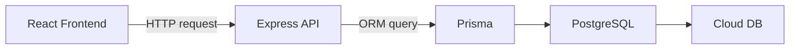

# 04. 技術選定 ver2（筋トレ管理アプリ）

このドキュメントは、[04_技術選定.md](04_%E6%8A%80%E8%A1%93%E9%81%B8%E5%AE%9A.md) の学習重視版です。

第1版では「できるだけ実装しやすい構成」を優先しましたが、この第2版では「できるだけ多くの分野を学べる構成」を優先して再選定しています。

ブログ向けに比較しやすいよう、既存ファイルは残し、このファイルを別バージョンとして新規作成します。

## 0. この版で重視すること
この版では、次の学習を広く経験できることを重視します。

- フロントエンド開発
- バックエンド開発
- フロントとバックの通信
- データベース設計と運用
- クラウドへの保存
- 将来のデプロイや公開

学習ポイント:
- 「作りやすい構成」と「広く学べる構成」は少し違います
- 今回は後者を優先するので、構成は少し重くなります

## 1. 今回の方針
今回は、役割がはっきり分かれる構成を選びます。

- フロントはフロントとして独立
- バックはバックとして独立
- DB はローカルでもクラウドでも扱える構成
- API 通信を自分で意識できる構成

つまり、「全部が1つにまとまった便利構成」よりも、「どうつながっているかが見えやすい構成」を選びます。

## 2. 第1候補の構成
今回の学習目的に一番合う第一候補は次です。

- フロントエンド: React + Vite + TypeScript
- バックエンド: Node.js + Express + TypeScript
- ORM: Prisma
- データベース: PostgreSQL
- ローカル開発補助: Docker
- クラウド保存先候補: Supabase または Railway 上の PostgreSQL
- グラフ描画: Recharts
- API 通信: fetch または Axios

## 3. なぜこの構成にするか

### 3-1. React + Vite + TypeScript
理由:
- フロントエンドを独立して学べる
- 画面、状態管理、フォーム、コンポーネント設計を素直に学べる
- Vite は開発体験が軽く、理解しやすい
- TypeScript を入れると、画面と API の型を意識する習慣がつく

学べること:
- コンポーネント設計
- 状態管理
- フォーム入力
- 画面遷移
- API 呼び出し
- 型安全なフロント実装

### 3-2. Node.js + Express + TypeScript
理由:
- バックエンドを独立して学べる
- API を自分で設計しやすい
- ルーティング、バリデーション、サービス層の考え方を学べる
- フロントからどう呼ばれるかを意識しやすい

学べること:
- REST API 設計
- リクエスト / レスポンスの流れ
- HTTP メソッド
- ルーティング
- サービス層の分離
- エラーハンドリング

### 3-3. PostgreSQL
理由:
- 実務でもよく使われる
- SQLite より本格的な RDB の学習ができる
- クラウド移行しやすい
- 今回のような複数テーブル設計と相性がよい

学べること:
- リレーショナルデータベースの基本
- テーブル設計
- 外部キー
- 制約
- インデックスの考え方
- ローカル DB とクラウド DB の違い

### 3-4. Prisma
理由:
- [docs/03_データ設計.md](docs/03_%E3%83%87%E3%83%BC%E3%82%BF%E8%A8%AD%E8%A8%88.md) をスキーマに落とし込みやすい
- SQL を完全に隠しすぎず、構造を理解しながら扱いやすい
- マイグレーションを学びやすい

学べること:
- ORM の役割
- スキーマ定義
- マイグレーション
- リレーションの実装
- 型付きDBアクセス

### 3-5. Docker
理由:
- DB をローカルで立てる学習ができる
- 環境差異を減らせる
- 将来バックエンドもコンテナ化しやすい

学べること:
- コンテナの基本
- DB の起動管理
- 開発環境の再現性
- docker-compose 相当の考え方

### 3-6. Supabase または Railway
理由:
- クラウドに DB を置く学習ができる
- ローカル開発後に「外部へ出す」流れを経験できる
- PostgreSQL ベースで移行しやすい

学べること:
- クラウド DB 接続
- 環境変数管理
- ローカルと本番の接続先切り替え
- デプロイ時の設定

## 4. この構成で学べる全体像
この構成の強みは、各技術がどう関係しているかを実感しやすいことです。



補足:
- 普段の開発では、フロントが API にリクエストを送る
- API は Prisma を通して DB を読む
- DB はローカルでもクラウドでも同じ設計思想で扱える

学習ポイント:
- この分離が見えると、「フロント」「バック」「DB」が何を担当しているか理解しやすいです
- 今回はこの関係を理解すること自体が大きな学習価値になります

## 5. 他の候補と比較したときの位置づけ

### Next.js 一体型構成より学べること
- フロントとバックの境界が分かりやすい
- API 通信の理解が深まる
- CORS やエンドポイント設計を学びやすい

### デメリット
- プロジェクトが分かれるので管理が増える
- 最初の設定量が増える
- 初学者向け最短コースではない

結論:
- 「早く作る」なら第1版の方が楽
- 「広く学ぶ」ならこの第2版の方が価値が大きい

## 6. ディレクトリ構成イメージ

```text
TrainingApp/
  frontend/
    src/
      components/
      pages/
      hooks/
      services/
      types/
  backend/
    src/
      routes/
      controllers/
      services/
      repositories/
      middleware/
      types/
    prisma/
      schema.prisma
  docs/
```

学習ポイント:
- frontend と backend を分けることで責務が見えやすくなります
- services や repositories を分けると、実務的な構成も学べます

## 7. API の学習で扱えること
この構成だと、次の API を自分で設計できます。

- GET /menu-groups
- POST /menu-groups
- GET /menu-groups/:id/exercises
- POST /workout-sessions
- GET /workout-sessions
- GET /graphs/weight-trend

学習ポイント:
- URL 設計
- HTTP メソッドの使い分け
- 入力値の検証
- フロントに返す JSON の形

## 8. DB の学習で扱えること
この構成だと、次の学習がしやすいです。

- PostgreSQL をローカルで立ち上げる
- Prisma schema を書く
- migration を作る
- seed データを入れる
- クラウド DB に切り替える

学習ポイント:
- 「設計したデータが、実際にどうテーブルになるか」を確認できます
- 将来 SQL を直接学ぶときにもつながります

## 9. クラウド学習の進め方
クラウドは最初から全部やる必要はありません。段階的に進めるのが安全です。

### ステップ1
- ローカルで PostgreSQL を動かす
- Prisma で接続する

### ステップ2
- フロントとバックをローカルで接続する
- API 経由で保存・取得する

### ステップ3
- DB を Supabase や Railway に移す
- 接続先を環境変数で切り替える

### ステップ4
- フロントとバックをデプロイする

学習ポイント:
- いきなりクラウドから始めるより、ローカルで構造を理解してから移す方が学びやすいです

## 10. この版で採用しないもの
今回は学習範囲を広げたいですが、それでも最初から入れない方がよいものがあります。

- マイクロサービス
- Kubernetes
- 複雑なメッセージキュー
- 本格的な認証プロバイダの統合
- GraphQL

理由:
- 今回のアプリ規模に対して重すぎる
- 学習対象が増えすぎて、中心がぼやけるため

## 11. この版の結論
今回の目的に最も合うのは次の構成です。

- フロント: React + Vite + TypeScript
- バック: Node.js + Express + TypeScript
- DB: PostgreSQL
- ORM: Prisma
- ローカル環境: Docker
- クラウド DB: Supabase または Railway
- グラフ: Recharts

この構成で学べること:
- フロント開発
- バックエンド開発
- API 通信
- DB 設計と運用
- ローカル環境構築
- クラウド接続

## 12. この段階での判断
もし目的が「最短でアプリを作る」なら第1版を推します。
もし目的が「広く学ぶ」なら、この第2版を推します。

今回の要望なら、この第2版の方が合っています。

## 13. 次に進むためのチェック
- [x] フロントとバックを分離する方針が決まっている
- [x] API 通信を学べる構成になっている
- [x] DB をローカルでもクラウドでも扱える方針がある
- [x] 学習範囲を広く取れる構成になっている

## 14. 次フェーズでやること
次はこの構成に合わせて、初期構築手順を設計するのが自然です。

次にやること:
1. frontend と backend のプロジェクトをどう作るか決める
2. PostgreSQL を Docker で立てる手順を決める
3. Prisma 初期化手順を決める
4. フロントからバックへ最初の API 接続を作る

## 15. まとめ
- 第1版は作りやすさ重視、第2版は学習範囲重視
- 今回は後者を優先し、技術を明確に分離した
- React / Express / PostgreSQL / Prisma / Docker / Cloud DB の組み合わせなら、広く学べる
- 少し難しくなるが、その分「全体がどうつながるか」を理解しやすい
