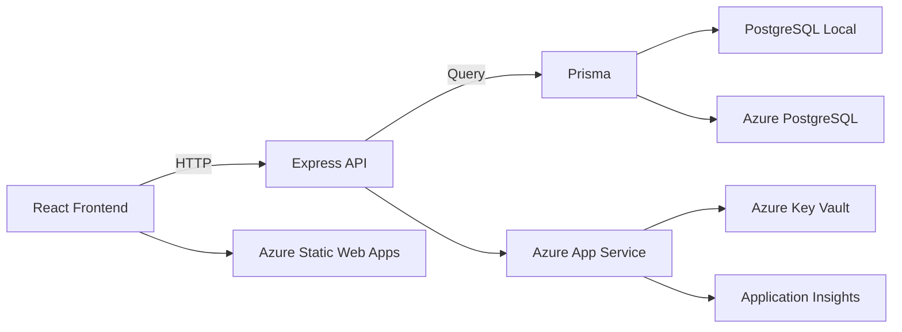

# 04. 技術選定 ver3 Azure版（筋トレ管理アプリ）

このドキュメントは、[04_技術選定ver2.md](04_%E6%8A%80%E8%A1%93%E9%81%B8%E5%AE%9Aver2.md) をベースに、Azure を学習目的で取り込む前提で再設計した技術選定資料です。

第2版ではクラウド候補を広く扱いましたが、この第3版では「Azure で何を学ぶか」を明確にして、実装まで進めやすい形にしています。

既存ファイルは残し、ブログで比較できるように別バージョンで作成します。

## 0. この版で重視すること
この版の目的は次の2つです。

1. アプリを完成させる
2. Azure を使った実務に近い学習を行う

学習対象:
- フロントエンド開発
- バックエンド開発
- API 通信
- PostgreSQL 設計
- Azure 上の DB 運用
- デプロイと運用監視
- シークレット管理

## 1. 採用する技術スタック

### アプリ層
- フロントエンド: React + Vite + TypeScript
- バックエンド: Node.js + Express + TypeScript
- ORM: Prisma
- グラフ: Recharts

### データ層
- ローカル開発DB: PostgreSQL（Docker）
- クラウドDB: Azure Database for PostgreSQL Flexible Server

### Azure 層
- フロント公開: Azure Static Web Apps
- バック公開: Azure App Service（Node.js）
- 設定情報管理: Azure Key Vault
- 監視: Application Insights + Azure Monitor

学習ポイント:
- ローカルで作ってから Azure へ移す段階構成にすると、仕組みを理解しながら進められます
- いきなり Azure だけで始めるより、トラブル時の切り分けがしやすくなります

## 2. なぜ Azure を採用するか

### 2-1. 学習価値
Azure を入れることで、次の実務的な学習ができます。

- 環境変数とシークレットの扱い
- 開発環境と本番環境の差分管理
- アプリと DB の接続管理
- ログと監視の基本
- コストを意識したクラウド運用

### 2-2. React / Express 構成との相性
- フロントとバックが分離されているので、Azure 上でも責務を保ちやすい
- バックエンドの接続先 DB をローカルから Azure PostgreSQL に切り替えやすい
- 将来 API を増やしても構成が崩れにくい

## 3. 全体アーキテクチャ



読み方:
- 開発初期は C -> D（ローカルDB）
- クラウド移行後は C -> E（Azure DB）
- デプロイ後は Frontend が F、Backend が G で稼働

## 4. 学習フェーズ設計
Azure を入れる場合は、次の順が最も学びやすいです。

### フェーズ1: ローカル完結
- React + Express + Prisma + PostgreSQL(Docker) で基本機能を完成
- ここで [03_データ設計.md](03_%E3%83%87%E3%83%BC%E3%82%BF%E8%A8%AD%E8%A8%88.md) の構造を実装

### フェーズ2: Azure DB 移行
- PostgreSQL 接続先を Azure Database for PostgreSQL に切り替える
- 環境変数で local / cloud を切り替える

### フェーズ3: Azure デプロイ
- フロントを Azure Static Web Apps へ
- バックを Azure App Service へ

### フェーズ4: 運用学習
- Application Insights でログ確認
- Key Vault で機密情報管理
- 監視と簡易アラートの設定

学習ポイント:
- フェーズ分割すると、問題が起きた時にどこで壊れたか追いやすいです
- まずは動く最小をローカルで作るのが成功しやすいです

## 5. Azure サービスの役割整理

### Azure Static Web Apps
用途:
- React フロントエンドの公開

学べること:
- フロントのデプロイ
- 環境別設定
- SPA の公開構成

### Azure App Service
用途:
- Express API のホスティング

学べること:
- Node.js バックエンドのデプロイ
- 環境変数設定
- API 稼働管理

### Azure Database for PostgreSQL
用途:
- 本番用 PostgreSQL

学べること:
- クラウド DB 接続
- 接続制御
- バックアップや運用の基本

### Azure Key Vault
用途:
- DB 接続文字列やキーの保管

学べること:
- 機密情報管理
- アプリ設定の分離

### Application Insights
用途:
- API エラーやパフォーマンスの観測

学べること:
- ログ解析
- 監視の基本
- エラー調査

## 6. 学習面でのメリットと注意点

### メリット
- フロント・バック・DB・クラウドの流れを一気通貫で学べる
- 実務に近い責務分離を体験できる
- デプロイと監視まで触れられる

### 注意点
- 学習量が多くなる
- Azure の概念が増える
- 無料枠と課金管理を意識する必要がある

対策:
- フェーズを分ける
- 1回に学ぶ対象を絞る
- まずは最小機能でクラウド接続を成功させる

## 7. 推奨ディレクトリ構成

```text
TrainingApp/
  frontend/
    src/
      components/
      pages/
      hooks/
      services/
      types/
  backend/
    src/
      routes/
      controllers/
      services/
      repositories/
      middleware/
      types/
    prisma/
      schema.prisma
  infra/
    docker/
    azure/
  docs/
```

補足:
- infra/azure に将来のデプロイメモや設定テンプレートを置くと、ブログでも追いやすいです

## 8. この版で採用しないもの
- Kubernetes
- マイクロサービス分割
- GraphQL
- 複雑な認証統合
- 高度な分散キャッシュ

理由:
- 今回のアプリ規模に対して学習対象が増えすぎるため
- まずは Azure での基本的な開発運用を固める方が価値が高いため

## 9. この版の結論
Azure を学習目的で使うなら、次の組み合わせが最適です。

- React + Vite + TypeScript
- Node.js + Express + TypeScript
- Prisma
- PostgreSQL（ローカルは Docker、クラウドは Azure PostgreSQL）
- Azure Static Web Apps
- Azure App Service
- Azure Key Vault
- Application Insights

この構成なら、あなたが希望している次の学習をすべて含められます。

- フロント開発
- バック開発
- フロントとバックの接続
- DB 設計と運用
- クラウド保存
- クラウドデプロイと監視

## 10. 次に進むためのチェック
- [x] Azure を含む技術選定ができている
- [x] ローカルから Azure へ移行する順序が明確
- [x] Azure サービスごとの役割が整理されている
- [x] 学習負荷への対策がある

## 11. 次フェーズでやること
次は初期構築フェーズです。

最初の実作業:
1. frontend / backend を作成
2. Docker で PostgreSQL を立ち上げ
3. Prisma 初期化
4. ローカルで API 接続確認

その次:
5. Azure PostgreSQL を作成
6. 接続先を切り替え
7. フロントとバックを Azure にデプロイ

## 12. まとめ
- Azure は学習目的で十分採用価値がある
- ただし最初から全部クラウドに寄せず、ローカル完成 -> Azure 移行が最も学びやすい
- この版は、広く学びたい要望に合わせた実践的な構成
